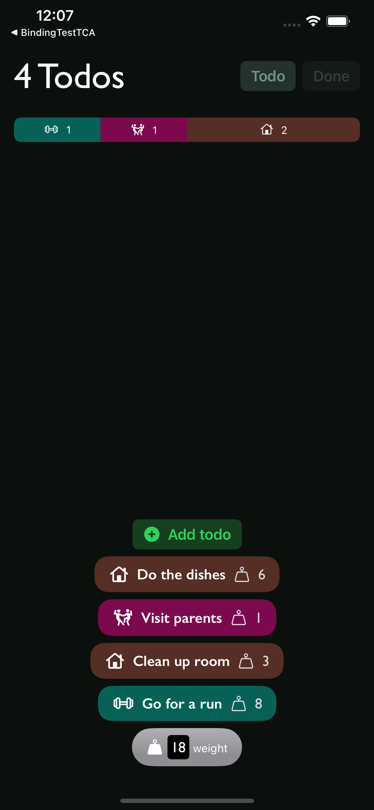
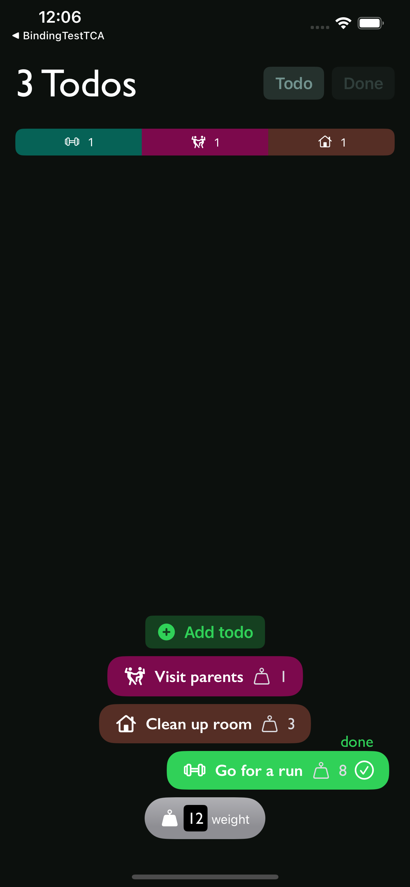
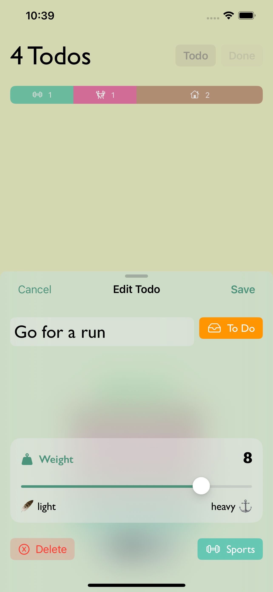
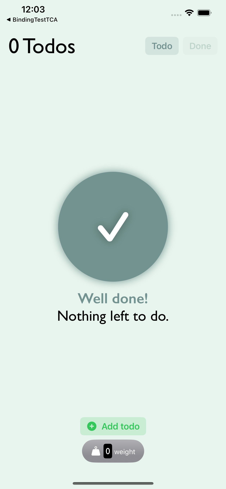
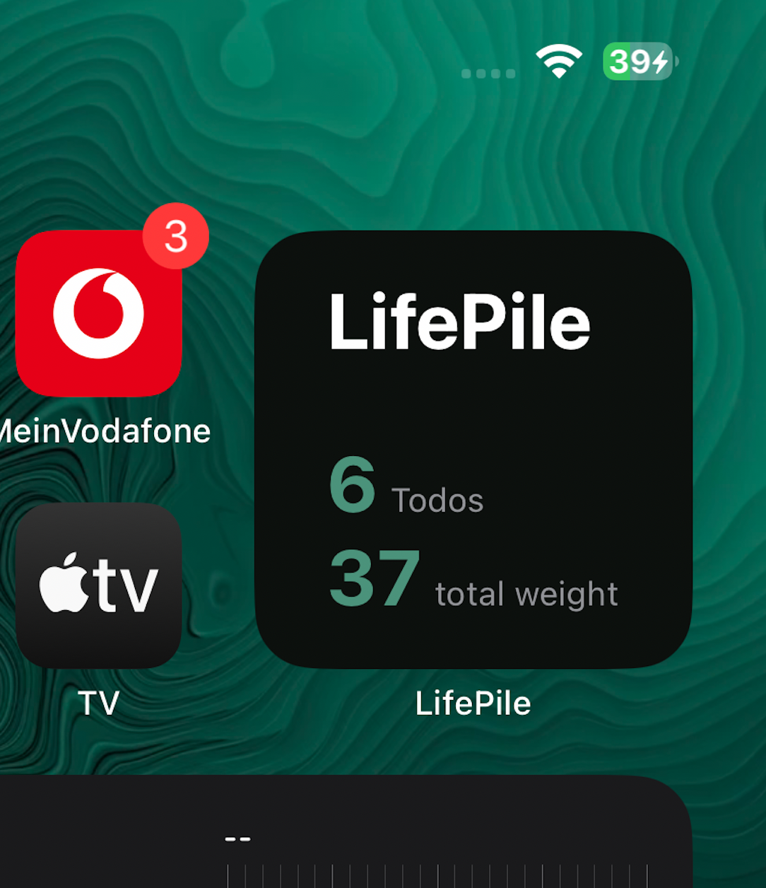

# LifePile

No more endlessly growing todo lists!

LifePile is a task management app that helps you actually complete tasks. All the todos in your life are visualized as a pile, thus the name. Every time you finish a todo, you can swipe it right and shrink your pile. Color-coded tags help you grasp which kind of tasks you have already completed and which you still need to finish. Tasks can be weighted - It simply feels good to complete a heavy todo, doesn't it? You will want to keep your LifePile low.

All todos             |  Completing a todo | Editing a todo | Everything's done | Homescreen Widget |
:-------------------------:|:-------------------------:|:-----------------:|:-----------------:|:-----------------:|:
 |   |  |  |  |
